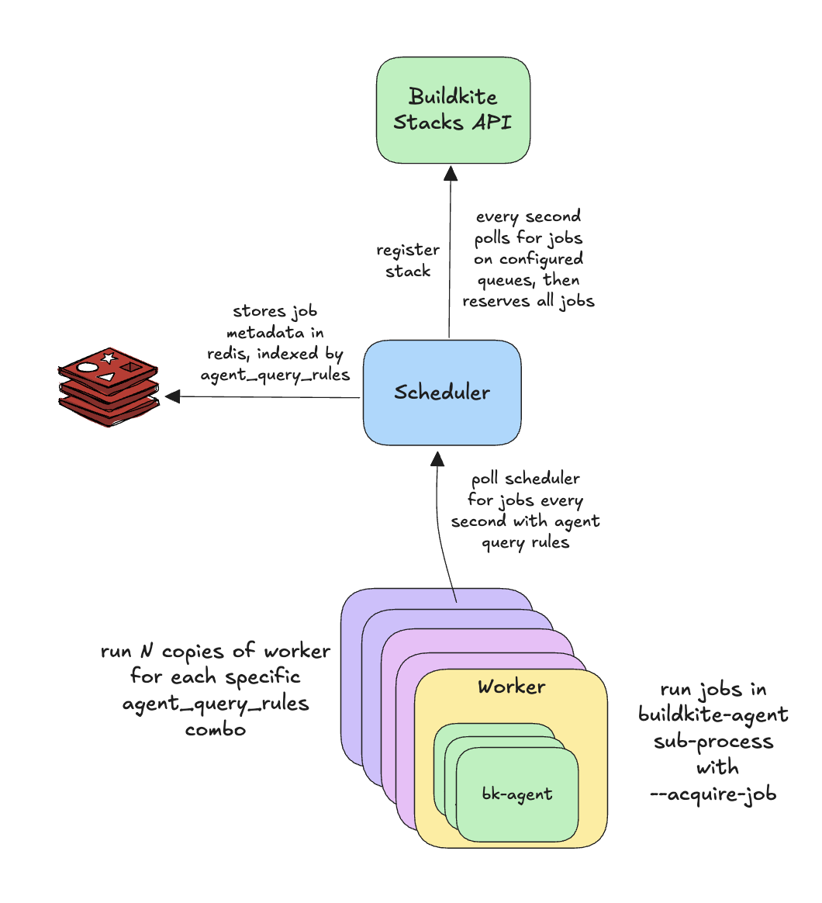

# Buildkite Stacks API Demo

A demonstration of using the [Buildkite Stacks API](https://buildkite.com/docs/apis/agent-api/stacks) to build a custom job scheduler with distributed workers.

## Architecture

This demo shows how to decouple job discovery from execution, giving you full control over dispatch logic:



### Components

- **API Server**: Registers as a Buildkite Stack, monitors configured queues, reserves matching jobs, stores them in Redis by agent query rules, and serves HTTP API for workers to poll
- **Workers**: Poll API server for jobs matching their configured query rules, spawn `buildkite-agent --acquire-job` processes (one job at a time per worker)
  - Acts as a lightweight wrapper around the Buildkite agent
- **Redis**: Job index organized by agent query rules. This could be any datastore in practice.

## Quick Start

### Prerequisites

- Docker & Docker Compose
- Buildkite account with a cluster

### 1. Get Buildkite Agent Token

Get an agent token (used by both server and workers):

1. Go to Buildkite → Settings → Agents
2. Copy an existing agent token or create a new one

### 2. Configure Environment

```bash
cp .env.example .env
```

Edit `.env` and add your token:

```bash
BUILDKITE_AGENT_TOKEN=your_agent_token_here
SCHEDULER_QUEUES=myqueue
WORKER_QUEUE=myqueue
WORKER_AGENT_QUERY_RULES="my_tag=my_value,another_tag=another_value"
```

### 3. Run Demo

```bash
docker compose up --abort-on-container-exit --build --scale worker=3
```

This starts:
- Redis (internal only)
- API Server (http://localhost:18888)
- Worker (3 instances)

### 4. Trigger a Build

Create a test pipeline in Buildkite:

```yaml
steps:
  - label: "Test Job"
    command: "echo Hello from custom scheduler"
    parallelism: 3
    agents:
      queue: "default"
      my_tag: "my_value"
      another_tag: "another_value"
```

Trigger a build and watch the logs to see the scheduling happen

## Configuration

All configuration is via environment variables (see `.env.example`):

### Server Options

| Variable | Default | Description |
|----------|---------|-------------|
| `BUILDKITE_AGENT_TOKEN` | (required) | Buildkite agent token |
| `SCHEDULER_QUEUES` | `default` | Comma-separated queue keys to monitor |
| `REDIS_ADDR` | `redis:6379` | Redis address |
| `LISTEN` | `:18888` | HTTP listen address |

### Worker Options

| Variable | Default | Description |
|----------|---------|-------------|
| `BUILDKITE_AGENT_TOKEN` | (required) | Buildkite agent token |
| `WORKER_AGENT_QUERY_RULES` | `queue=default` | Comma-separated query rules (defines job matching, passed as --tags to buildkite-agent) |
| `WORKER_TAGS` | - | Comma-separated additional metadata tags (not used for job matching, passed as --tags to buildkite-agent) |
| `WORKER_QUEUE` | - | Buildkite queue name (passed as --queue to buildkite-agent) |
| `WORKER_API_SERVER` | `http://localhost:18888` | API server URL |
| `WORKER_POLL_INTERVAL` | `2s` | Poll interval |
| `BUILDKITE_AGENT_PATH` | `/usr/local/bin/buildkite-agent` | Path to agent binary |

Note: The worker combines the query rules and queue when querying the scheduler for jobs.

## API Endpoints

The API server exposes:

**GET /health**
- Health check

**GET /jobs?query=queue=default,arch=amd64**
- Get next job matching query rules
- Returns 204 if no jobs available
- Returns job JSON if available (and removes from queue)

**POST /jobs/{uuid}/complete**
- Mark job as complete (cleanup)

**GET /stats**
- View queue statistics

Example:
```bash
curl http://localhost:18888/stats
```

## CLI Usage (Local Development)

Build the binary:

```bash
go build -o scheduler .
```

View help:

```bash
./scheduler --help
./scheduler server --help
./scheduler worker --help
```

Run server:

```bash
export BUILDKITE_AGENT_TOKEN=xxx
./scheduler server
```

Run worker:

```bash
export BUILDKITE_AGENT_TOKEN=xxx
./scheduler worker
```

## How It Works

### 1. Stack Registration

API server registers with Buildkite as a custom stack:

```go
RegisterStack(ctx, RegisterStackRequest{
    Key:      "custom-scheduler-demo",
    Type:     StackTypeCustom,
    QueueKey: "default",
})
```

### 2. Job Monitoring

API server polls Buildkite every second for scheduled jobs:

```go
ListScheduledJobs(ctx, ListScheduledJobsRequest{
    StackKey:        "custom-scheduler-demo",
    ClusterQueueKey: "default",
})
```

### 3. Job Reservation

When jobs are found, API server reserves them:

```go
BatchReserveJobs(ctx, BatchReserveJobsRequest{
    StackKey:                 "custom-scheduler-demo",
    JobUUIDs:                 []string{...},
    ReservationExpirySeconds: 300,
})
```

### 4. Job Indexing

Reserved jobs are stored in Redis, indexed by their `agent_query_rules` (from Buildkite):

```
Redis Key: jobs:arch=amd64,queue=linux
Value: [{"uuid": "...", "queue_key": "default", ...}]
```

### 5. Worker Polling

Workers poll the API server with their query rules:

```bash
GET /jobs?query=queue=linux,arch=amd64
```

### 6. Agent Execution

When a worker gets a job, it spawns `buildkite-agent` with its combined query rules and tags:

```bash
buildkite-agent start --acquire-job <uuid> --token <token> --tags queue=linux,os=ubuntu,arch=amd64,hostname=worker-1 --queue default
```

## References

- [Buildkite Stacks API Docs](https://buildkite.com/docs/apis/agent-api/stacks)
- [Buildkite Stacks API Go Library](https://github.com/buildkite/stacksapi)
- [Agent Stack Kubernetes](https://github.com/buildkite/agent-stack-k8s) - Reference implementation
- [Buildkite Agent Docs](https://buildkite.com/docs/agent/v3)
